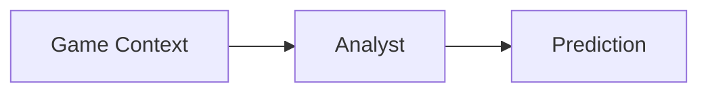
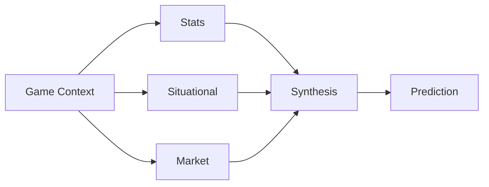
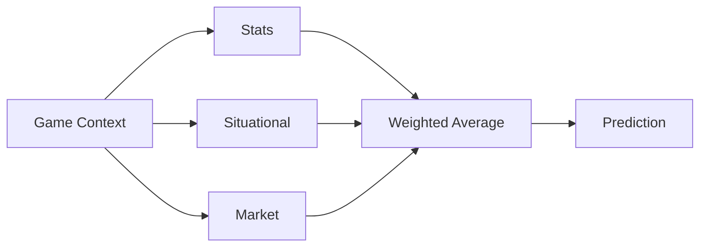
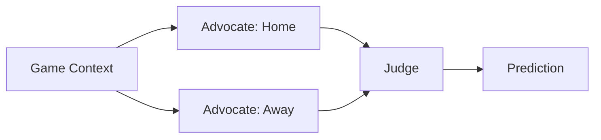
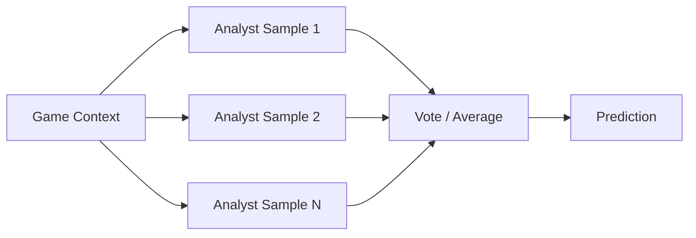

# Random Sample - 2026 season
For this season's experiment I'm returning to my roots with AI again (the last couple of seasons I've been truly randomly picking the winners due to lack of time). Going to use a bit of Spec Driven Development (SDD) here. not going to limit to just AI created but rather, perform a combination of SDD for the infrastructure/scaffolding and I'll focus on the model design.

My motivation this year for SDD is that this appears to be a more common approach. This is a good use case for getting more hands-on experience with this development approach. I'm also going with a more Agentic solution over traditional machine learning or math equation like I've done in the past. The motivation for Agentic is purely to try it. This is a pattern I have node attempted before for Yahoo Pro Pick'em.


# Rules
Some years I don't let myself adjust or modify the code or math involved. This has produced some "interesting results." For this year I am going hold myself to:

1. No direct development! all code MUST be via SDD.
2. Ok to update prompts through the season.
3. Ok to fix bugs.
4. Not ok to introduce a new agent type once the season has started. This agent will need to perform on its own once the season starts.
5. Not ok to replace with another candidate. Once I select the agent design I will stick with that design for the season.
6. No "helping." The prediction is the prediction. If I as the human have some data such as a team sitting a starter or extreme weather I will not adjust the predictions. I will rely only on the agent predictions.
7. Ok to use different models.


# Architecture
The Yahoo Pro Pick'em agent is a multi-agent system orchestrated with [LangGraph](https://github.com/langchain-ai/langgraph) rather than a single script: a graph of specialized agents (schedule resolution, prediction, confidence ranking, validation, and reporting) hands state to one another, with a validation loop that can send bad output back for re-ranking. See [specs/pickem-agent/PRD.md](specs/pickem-agent/PRD.md) for the full spec.

# Design Options
The Prediction Agent node doesn't hardcode a single approach — it dispatches to one of several registered `agent_design` strategies (see [specs/pickem-agent/DESIGN.md §3.3](specs/pickem-agent/DESIGN.md)), all sharing the same upstream context and downstream ranking/validation. The backtesting harness sweeps across these designs (plus model and context-tier) to see which one actually wins the most seasons before it's promoted to the live config. Each is a genuinely different bet on how to turn game context into a pick, not just a prompt-wording variant.

## Single Analyst (baseline)
One LLM call per game, given the full context blob in one shot.



The simplest possible design and the baseline everything else has to beat: one prompt, one model call, full context. Cheap and fast, but asks a single call to reason jointly over stats, situational factors, and market signals without any structural help — whatever the model conflates or overweights, nothing downstream corrects.

## Specialist Synthesis
Three specialists each see only their own data slice, and a separate synthesis call combines their views.



Three specialists — stats, situational, market — each reason over only their own slice of context, so no single call has to juggle every signal at once. A fourth call (synthesis) then sees all three summarized opinions and produces the final pick. The bet: narrower context per call yields sharper specialist reasoning, and the synthesis step can weigh conflicting signals the way a human handicapper would — at the cost of four LLM calls per game instead of one.

## Specialist Deterministic
Same three specialists as above, but combined by a fixed weighted average in code instead of a fourth LLM call.



Identical fan-out to Specialist Synthesis, but the combination step is deterministic code — a weighted average of the three win probabilities — rather than a fourth model call. This variant exists specifically to isolate a question: does letting an LLM synthesize the specialists' views actually beat just averaging them? It's cheaper and perfectly reproducible; if it backtests as well as Specialist Synthesis, the synthesis call isn't earning its cost.

## Debate Advocate
Two advocates argue opposite sides using the same full context; a judge sees both cases and decides.



Rather than splitting context by data type, this design splits it by team: one advocate is prompted to build the strongest case for the home team, another for the away team, both from the identical full context. A judge call then weighs both one-sided arguments and picks a winner. The idea is adversarial — forcing an explicit case for the "wrong" side surfaces reasoning a single neutral analyst might skip past, at the cost of three calls per game and a judge that has to referee, not just aggregate.

## Ensemble Self-Consistency
The single-analyst prompt, sampled N times and combined in code.



No new prompt at all — this reuses the baseline single-analyst call verbatim, but samples it N times (5 in v1) and combines the results in code by vote/average, the same way Specialist Deterministic combines its specialists. The bet is that sampling variance itself carries signal: if the model flips its pick across samples, that instability is informative, and averaging over it should be more robust than trusting any one sample — at the cost of N× the calls of the baseline for the same context.

# Dataset
Using [nflverse](https://github.com/nflverse) for NFL game data — free, no subscription or API key required, and covers both historical (back to 1999) and current season data, updated nightly in-season. Access is via [nflreadpy](https://pypi.org/project/nfl-data-py/) (Python; R users have the equivalent [nflreadr](https://nflreadr.nflverse.com/)), reading published CSV/parquet/RDS releases from [nflverse/nfldata](https://github.com/nflverse/nfldata) and [nflverse/nflverse-data](https://github.com/nflverse/nflverse-data).

The agent only ever pulls three nflverse tables, and only the regular season (`game_type == "REG"`) slice of each:

| Table (`nflreadpy` call) | What it provides here | Used by |
| --- | --- | --- |
| `load_schedules` | Game IDs, kickoff time, scores, and — already columns on this same table, so no extra fetch — rest days, divisional-game flag, roof/surface, and the closing spread/total/moneyline lines | Schedule Agent; the `situational` and `market` specialist roles (§ Design Options); the market-favorite baseline |
| `load_team_stats` | Per-game passing/rushing EPA and play counts, used to derive offensive/defensive EPA-per-play | `standard`/`rich` context tiers only |
| `load_injuries` | Weekly injury report status (Out/Doubtful/Questionable) per team | `rich` context tier only, best-effort — nflverse's injury coverage varies by season, so a missing report just yields zero counts rather than an error |

Team record, point differential, last-5-games form, and head-to-head history are *not* separate nflverse datasets — they're computed locally from the cached schedule table, and always **point-in-time**: only games completed strictly before the target week are considered, so backtests never leak a team's future results into a past prediction (see [specs/pickem-agent/DESIGN.md §6](specs/pickem-agent/DESIGN.md)).

How much of this a given game actually sees depends on its `context_level`:

- **minimal** — record and point differential only
- **standard** — + recent form (last 5 games) and EPA-per-play
- **rich** — + head-to-head history, the market line, and injury counts

Fetched data is cached in SQLite, refreshed at most once per season per call (not per game) and only when a week isn't yet marked final — see [nflverse_client.py](src/random_sample/pickem/nflverse_client.py).

# Setup & Usage
Requires Python 3.12+ and a running [Ollama](https://ollama.com) instance (the LLM calls are designed to stay local — no per-call API cost, no data leaving the machine).

```bash
uv sync
ollama pull <model>   # whatever `model` in config.toml points at
```

Everything runs through the `pickem` CLI (installed as a project script):

- `pickem recommend [--week N] [--season Y]` — run the graph once with the production config in [config.toml](config.toml), print and persist that week's picks. Defaults to the upcoming week.
- `pickem score [--week N] [--season Y]` — grade a week's already-recorded live picks against real results and print the season-to-date point total. Defaults to the most recently *completed* week.
- `pickem backtest --seasons ... --agent-design ... --prompt-variant ... --model ... --context-level ...` — walk-forward replay of a config grid across historical seasons. All five flags are required, comma-separated lists (`--seasons` also accepts ranges like `2022-2024`) — there's no sensible "run everything" default given the size of the full cross-product.
- `pickem report --seasons ...` — build a self-contained `report.html` (leaderboard, calibration chart, season trends) from whatever `backtest` runs are already on file for those seasons.

All state — cached nflverse data, picks, scores, and the LLM response cache — lives in a local SQLite file (`pickem.db`, gitignored, created on first run).

**Note:** [config.toml](config.toml)'s model is currently a `:cloud`-routed Ollama model, a placeholder used only to prove the wiring end to end — swap it for a real local model before any live/production use.

# Status
Built as a sequence of milestones, each producing something runnable before the next adds scope (full detail in [specs/pickem-agent/TASKS.md](specs/pickem-agent/TASKS.md)):

- [x] **A — Vertical slice** — `recommend` works end-to-end for `single_analyst`
- [x] **B — Result ingestion** — `score` grades live picks against real outcomes
- [x] **C — Remaining strategies** — all 5 design strategies (§ Design Options) runnable via `recommend`
- [x] **D — Backtesting harness** — `backtest` walk-forward replay, verified point-in-time safe
- [x] **E — Evaluation & reporting** — `report.html` leaderboard, calibration and season-trend charts, baselines
- [ ] **F — Promotion & hardening** — run the full historical grid, hand-pick and promote the production config, swap the placeholder cloud model for a real local one, and do a first full live dry run
- [ ] **G — Score prediction & weekly extremes** *(depends on F — only built for whichever config F promotes)* — predict a final score for each team in every game, and surface the single team predicted to score highest and the single team predicted to score lowest across the whole week's slate (display/analysis only — never feeds confidence ranking or point scoring)

Nothing here has been promoted to production yet — `config.toml` still holds Milestone A's placeholder config, not a backtest-selected one.
