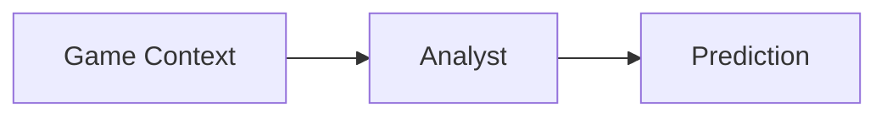
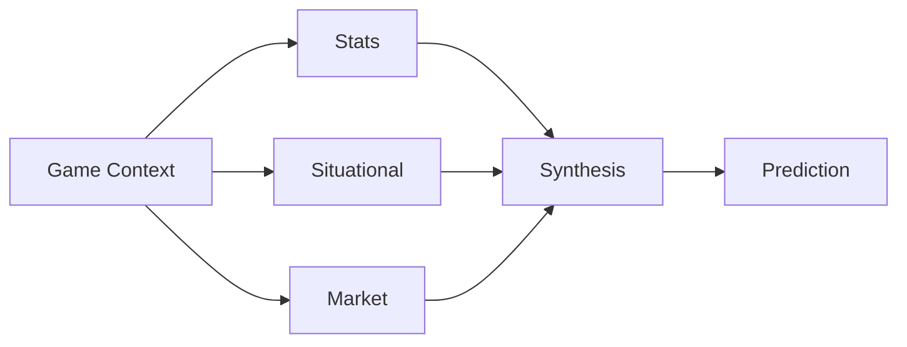
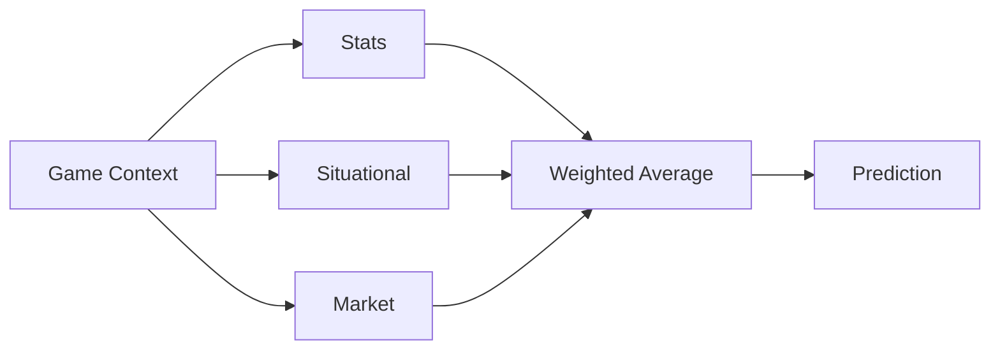
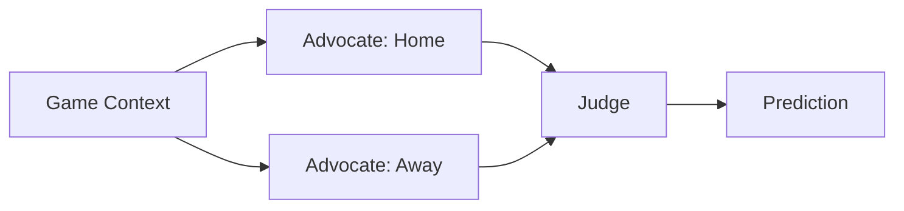
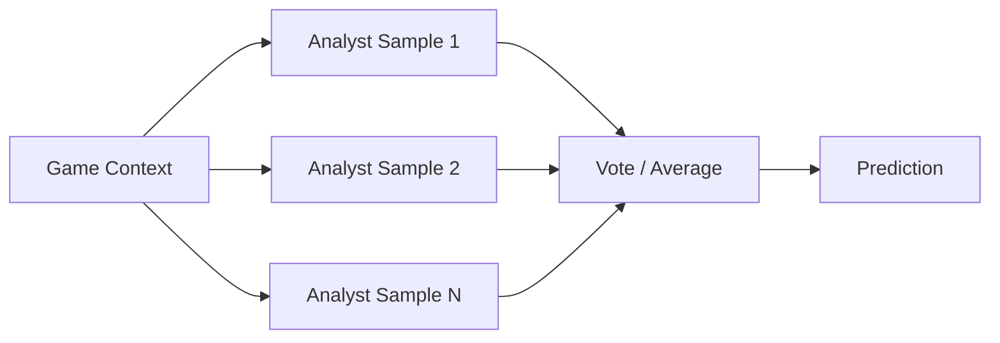

# Random Sample - 2026 season
For this season's experiment I'm returning to my roots with AI again (the last couple of seasons I've been truly randomly picking the winners due to lack of time). Going to use a bit of Spec Driven Development here. not going to limit to just AI created but rather, perform a combination of SDD for the infrastructure/scaffolding and I'll focus on the model design.

# Architecture
The Yahoo Pro Pick'em agent is a multi-agent system orchestrated with [LangGraph](https://github.com/langchain-ai/langgraph) rather than a single script: a graph of specialized agents (schedule resolution, prediction, confidence ranking, validation, and reporting) hands state to one another, with a validation loop that can send bad output back for re-ranking. See [specs/pickem-agent/PRD.md](specs/pickem-agent/PRD.md) for the full spec.

# Design Options
The Prediction Agent node doesn't hardcode a single approach — it dispatches to one of several registered `agent_design` strategies (see [specs/pickem-agent/DESIGN.md §3.3](specs/pickem-agent/DESIGN.md)), all sharing the same upstream context and downstream ranking/validation. The backtesting harness sweeps across these designs (plus model and context-tier) to see which one actually wins the most seasons before it's promoted to the live config. Each is a genuinely different bet on how to turn game context into a pick, not just a prompt-wording variant.

## Single Analyst (baseline)
One LLM call per game, given the full context blob in one shot.

The simplest possible design and the baseline everything else has to beat: one prompt, one model call, full context. Cheap and fast, but asks a single call to reason jointly over stats, situational factors, and market signals without any structural help — whatever the model conflates or overweights, nothing downstream corrects.

## Specialist Synthesis
Three specialists each see only their own data slice, and a separate synthesis call combines their views.

Three specialists — stats, situational, market — each reason over only their own slice of context, so no single call has to juggle every signal at once. A fourth call (synthesis) then sees all three summarized opinions and produces the final pick. The bet: narrower context per call yields sharper specialist reasoning, and the synthesis step can weigh conflicting signals the way a human handicapper would — at the cost of four LLM calls per game instead of one.

## Specialist Deterministic
Same three specialists as above, but combined by a fixed weighted average in code instead of a fourth LLM call.

Identical fan-out to Specialist Synthesis, but the combination step is deterministic code — a weighted average of the three win probabilities — rather than a fourth model call. This variant exists specifically to isolate a question: does letting an LLM synthesize the specialists' views actually beat just averaging them? It's cheaper and perfectly reproducible; if it backtests as well as Specialist Synthesis, the synthesis call isn't earning its cost.

## Debate Advocate
Two advocates argue opposite sides using the same full context; a judge sees both cases and decides.

Rather than splitting context by data type, this design splits it by team: one advocate is prompted to build the strongest case for the home team, another for the away team, both from the identical full context. A judge call then weighs both one-sided arguments and picks a winner. The idea is adversarial — forcing an explicit case for the "wrong" side surfaces reasoning a single neutral analyst might skip past, at the cost of three calls per game and a judge that has to referee, not just aggregate.

## Ensemble Self-Consistency
The single-analyst prompt, sampled N times and combined in code.

No new prompt at all — this reuses the baseline single-analyst call verbatim, but samples it N times (5 in v1) and combines the results in code by vote/average, the same way Specialist Deterministic combines its specialists. The bet is that sampling variance itself carries signal: if the model flips its pick across samples, that instability is informative, and averaging over it should be more robust than trusting any one sample — at the cost of N× the calls of the baseline for the same context.

# Dataset
Using [nflverse](https://github.com/nflverse) for NFL game data — free, no subscription or API key required, and covers both historical (back to 1999) and current season data, updated nightly in-season.

- Data: [nflverse/nfldata](https://github.com/nflverse/nfldata) and [nflverse/nflverse-data](https://github.com/nflverse/nflverse-data) (play-by-play, schedules, rosters, betting lines, etc. as CSV/parquet/RDS releases)
- Python access: [nfl_data_py](https://pypi.org/project/nfl-data-py/) / nflreadpy
- R access: [nflreadr](https://nflreadr.nflverse.com/)
